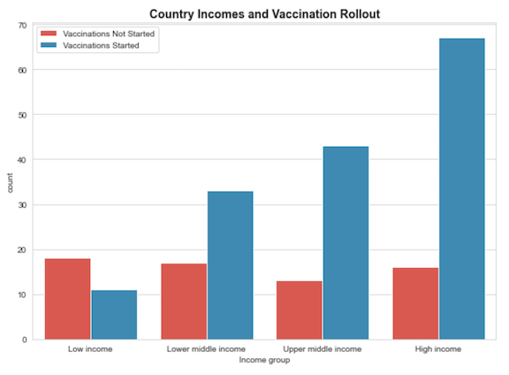
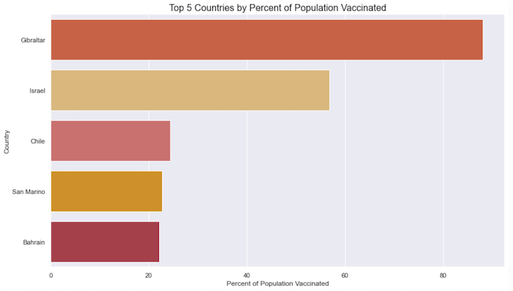
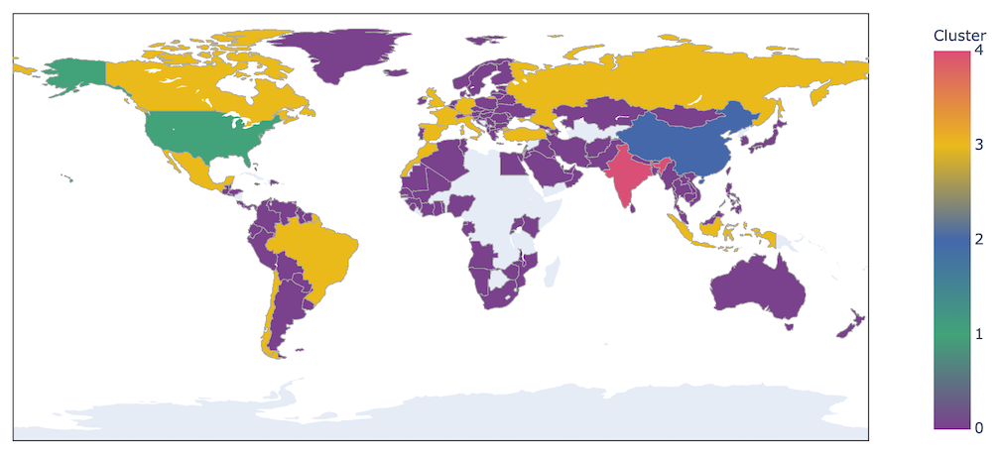
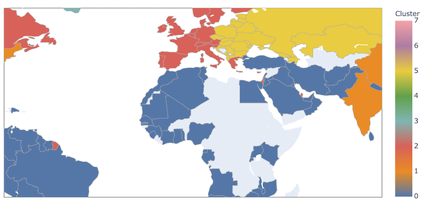
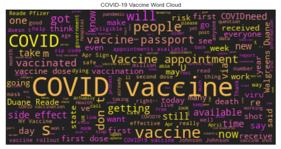
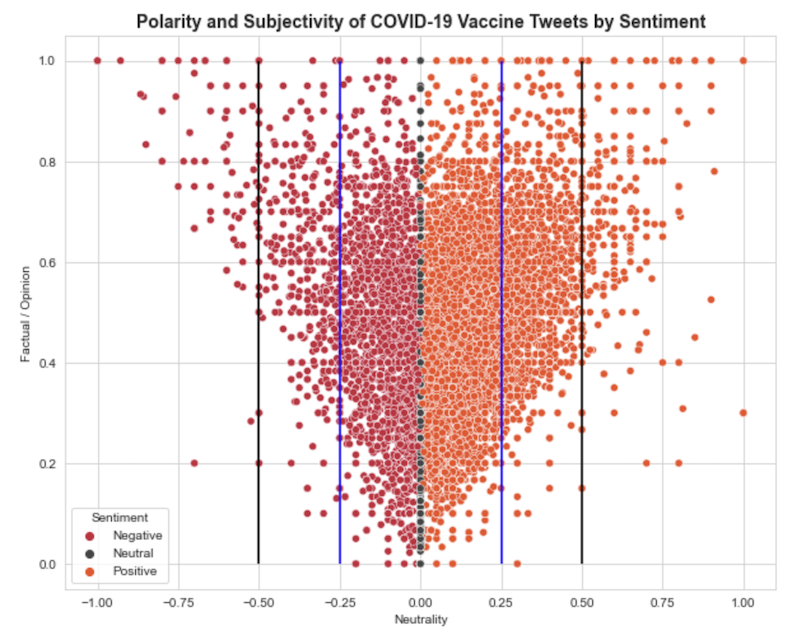
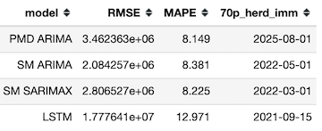
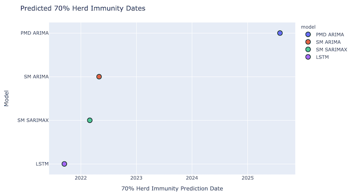

# Worldwide COVID-19 Vaccine Exploration

By Cassie Nutter

 

 
image from Unsplash

# Description

The coronavirus disease (COVID-19) is an infectious disease caused by a newly discovered coronavirus.

Most people infected with the COVID-19 virus will experience mild to moderate respiratory illness and recover without requiring special treatment.  Older people, and those with underlying medical problems like cardiovascular disease, diabetes, chronic respiratory disease, and cancer are more likely to develop serious illness.

The best way to prevent and slow down transmission is to be well informed about the COVID-19 virus, the disease it causes and how it spreads. Protect yourself and others from infection by washing your hands or using an alcohol based rub frequently and not touching your face. 

The COVID-19 virus spreads primarily through droplets of saliva or discharge from the nose when an infected person coughs or sneezes, so it’s important that you also practice respiratory etiquette (for example, by coughing into a flexed elbow).

[Source: World Health Organization](https://www.who.int/health-topics/coronavirus#tab=tab_1)

---

When writing this in April 2021, it has been over a year since the pandemic was formally announced. While there are still unknowns regarding COVID-19, we are much more familiar than in the beginning. So much more that a few vaccines have been created and released. 

Again, the cycle of unknowns continues because we do not know how long these vaccines will protect us, but many are hopeful that it will return the world to some semblance of normalcy. 

While looking at the statistics for one's own country is important, others may be concerned about the global economy and wonder when international travel and trade will resume unencumbered. **Herd immunity** has been tossed around as the goal post for when we can move about the way we used to. _Herd immunity_ is resistance to the spread of infectious disease based on the immunity of a high proportion of individuals being exposed to the disease or vaccinated. The percent of people that need to be exposed or vaccinated differs from expert to expert, but most fall within the 70-80% range.

---

This project aims to look at the data on worldwide vaccinations. It will look at the progress that has been made, which countries are ahead and which are not. In addition,this project contains an analysis of COVID-19 vaccine sentiments collected from Twitter. Lastly, it looks at when the world might reach 70% herd immunity based on the data available for fully vaccinated people.

# Data

The data for the project was obtained from [Our World in Data](https://ourworldindata.org/covid-vaccinations). There are multiple different datasets available at the site. 

_Datasets used from OWID include:_
* all COVID data, containing over 80,000 data points
* all vaccination data
* people fully vaccinated data

_Other sites used include:_
* World Bank Group
    * List of Countries and their respective income group
* API's
    * Twitter
    * Google Cloud Platform - specifically Cloud Translation and Cloud Natural Language 

# Data Cleaning and Exploration

Since data reporting is not the same in all countries, there was a lot of missing data. This project focused on fully vaccinated individuals, which is fairly new and emerging. Because of this, not a lot of data exists, and countries start vaccinating at different times. 

Data cleaning primarily involved making sure the data was accurate to each country.
Continents and the 'world' were removed when analyzing countries as well as the United Kingdom, which encompasses several smaller countries that were accounted for in the data.

Income groups were added to the countries to add another dimension to the analysis.

The image above shows the number of countries that have and have not started vaccinating residents by their income groups. A little over 80% of high income countries have begun vaccinations while only 38% of low income countries have started vaccinating people. 

Addressing global travel and trade will include the need to make sure all countries are around 70% vaccinated. Unfortunately, the lower income countries have been left behind and this will need to be remedied to resume globalization.

As of April 10, 2021, these were the five countries that have vaccinated the largest percent of their populations. 
* Gibraltar: has a small population and access to vaccines from Britain
* Israel: the Prime Minister negotiated early with Pfizer and already had an efficient health-care system in place enabling a quick vaccine rollout

# Market Segmentation

K-Means clustering and Hierarchical Agglomerative clustering were both used to attempt segment countries. The segments could then be used to identify countries strengths and weaknesses when vaccinating residents. 

Below is an image of K-Means cluster using PCA(principal component analysis) and five clusters on only vaccine data.

The unsupervised learning method separated the India, China and the United States into their own clusters. The two remaining clusters are contain multiple countries.

Upon inspection, the algorithm found that India, China, and the U.S. have the three highest daily vaccinations and the highest total vaccinations. Other countries that have given millions of doses, like Brazil, Turkey, Russia and Chile were clustered together. Countries with lower vaccinations were clustered together as well.

More data was added, this time including COVID-19 data such as:
* new cases
* new deaths
* gdp per capita
* median age
* cardiovascular death rate
* human development index
* percent of population vaccinated
* etc, more quantitative data

From this, K-Means was run again, this time using 8 clusters. The photo below only shows a portion of the map to show detail.

# Twitter Sentiment Analysis

Using the Twitter API, I gathered almost 20,000 Tweets using the keywords "covid" and "vaccine". Some Tweets were removed because they only contained links.

Not all Tweets were in English. There were 1,429 Tweets in different languages ranging from French, Spanish and Japanese to Swedish, Korean, and Norwegian. Google Cloud Platform's Cloud Translation API was used to translate to English.

From there Google Cloud Natural Language and TextBlob were used to analyze the sentiment of the Tweets as "Positive", "Negative" or "Neutral".

This photo shows that not only are there more positive Tweets than negative ones (9431 vs. 3329 to be exact), but that the positive Tweets are **more** positive than the negative Tweets are negative. If you look between the black and blue lines and even past the black lines, you will see that the positive Tweets stretch further out. 

After the sentiment analysis, models were built to see if they could learn and predict the classification of the Tweets. A hyperparameter tuned Support Vector Machine model was able to get up to 80% accuracy on the unseen data.

# Time Series Analysis

The data used to complete the time series analysis looked only at the number of people fully vaccinated in the world.
Multiple different algorithms were used to attempt to forecast when the world might hit a 70% herd immunity.

The different models used were:
- PMD's Auto ARIMA
- statsmodel's ARIMA
- statsmodel's SARIMAX with GridSearch
- LSTM neural network

---

Unfortunately, because the vaccine is so new, there was not a lot of data to use when attempting to forecast a date.
The most recent data was obtained and the last date with data was April 10, 2021. There were only 103 data points available for this analysis.

Using Root Mean Squared Error(RMSE) and Mean Absolute Percentage Error(MAPE), the model that did the best at forecasting a herd immunity date was statsmodel's ARIMA. It has the lowest RMSE of all the models and the MAPE is only  .2% higher than the lowest score. 

It also predicts the world will reach herd immunity in May 2022. I am not sure if this is likely or not, but seems plausible.

**Disclaimer**
Predicting a date for herd immunity is very complex. There are many factors that were not included in the prediction. For example:
- population was adjusted to exclude people under 16 (some vaccines have been approved, but not all)
- fully vaccinated was defined as an individual receiving two doses, while some vaccines only require one dose
- potential approval of new vaccines was not accounted for
- herd immunity assumes vaccines will continue to be effective longer than 6 months
